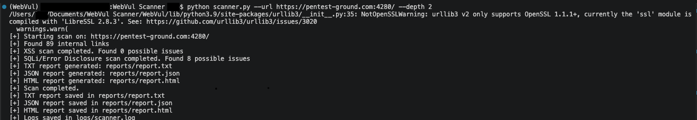
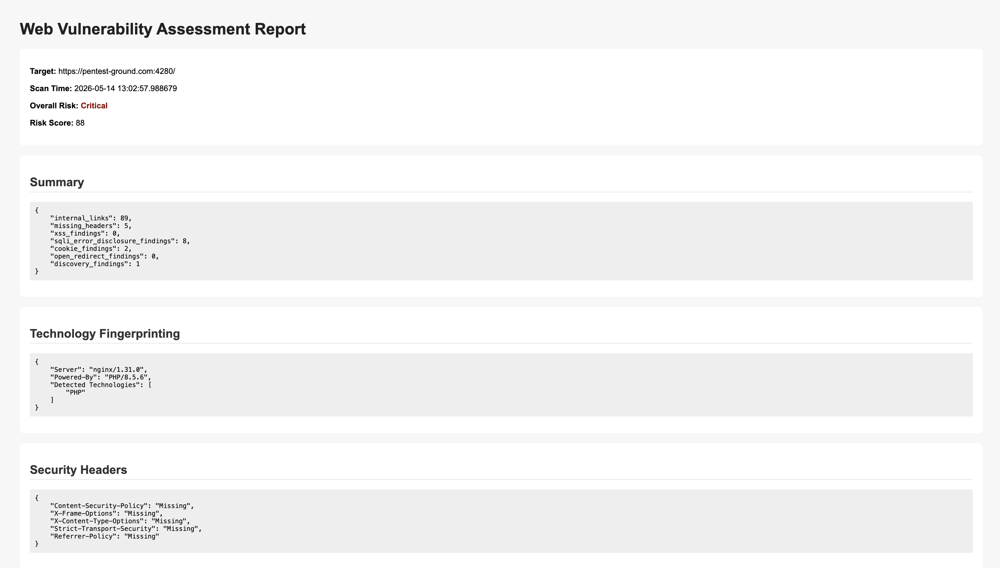
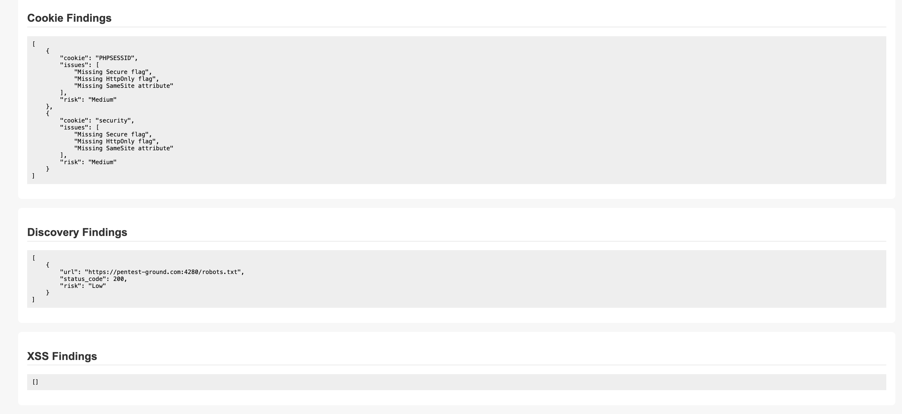
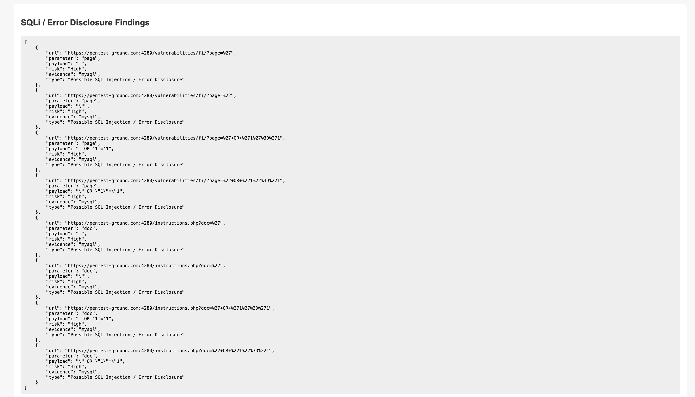
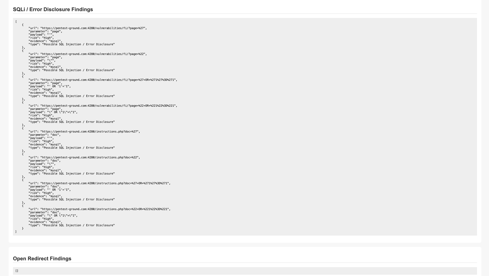
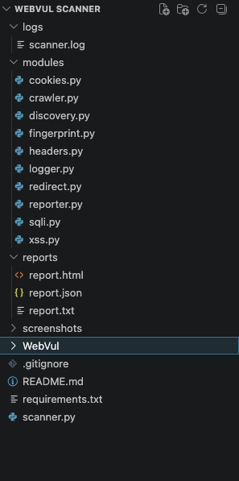
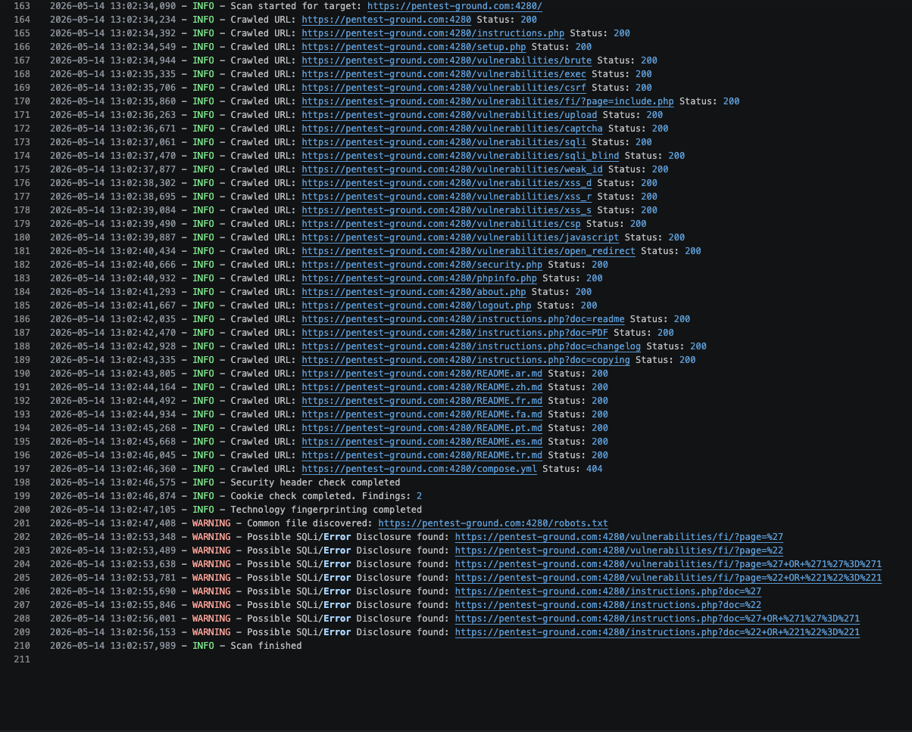

# WebVul Scanner

A modular Python-based web vulnerability scanner designed to perform automated web reconnaissance and identify common web security misconfigurations and vulnerability indicators.

The project focuses on practical penetration testing concepts including:
- Website crawling
- Security header analysis
- Cookie security inspection
- Reflected XSS testing
- SQL injection / error disclosure detection
- Open redirect testing
- Technology fingerprinting
- Common file discovery
- Professional report generation

---

# Features

## Reconnaissance
- Recursive internal link crawling
- robots.txt discovery
- sitemap.xml discovery
- Common file exposure checks
- Technology fingerprinting

## Security Analysis
- HTTP security header analysis
- Cookie security checks
- Reflected XSS detection
- SQL injection / error disclosure detection
- Open redirect detection

## Reporting
- TXT report export
- JSON report export
- HTML report export
- Risk scoring system
- Professional logging system

## Architecture
- Modular scanner design
- Extensible vulnerability modules
- Structured reporting workflow
- CLI-based usage

---

# Technologies Used

| Technology | Purpose |
|---|---|
| Python 3 | Core development |
| Requests | HTTP communication |
| BeautifulSoup4 | HTML parsing |
| Argparse | CLI argument handling |
| Logging | Activity tracking |
| JSON | Structured report export |

---

# Project Structure

```text
WebVul-Scanner/
├── scanner.py
├── requirements.txt
├── README.md
├── LICENSE
├── modules/
│   ├── crawler.py
│   ├── headers.py
│   ├── cookies.py
│   ├── redirect.py
│   ├── fingerprint.py
│   ├── discovery.py
│   ├── xss.py
│   ├── sqli.py
│   ├── reporter.py
│   └── logger.py
├── logs/
├── reports/
├── screenshots/
```

---

# Scanner Workflow

```text
Target URL
    ↓
Crawler Module
    ↓
Reconnaissance
    ↓
Security Analysis Modules
    ├── Headers
    ├── Cookies
    ├── XSS
    ├── SQLi
    ├── Redirects
    ├── Discovery
    └── Fingerprinting
    ↓
Risk Analysis
    ↓
TXT / JSON / HTML Reports
```

---

# Installation

## Clone Repository

```bash
git clone https://github.com/mitt-14/WebVul-Scanner.git
```

## Move Into Project Directory

```bash
cd WebVul-Scanner
```

## Create Virtual Environment

### macOS / Linux / Windows

```bash
python3 -m venv venv
source venv/bin/activate
```

### Windows

```bash
python -m venv venv
venv\Scripts\activate
```

## Install Dependencies

```bash
pip install -r requirements.txt
```

---

# Usage

## Basic Scan

```bash
python scanner.py --url https://example.com
```

## Scan With Depth

```bash
python scanner.py --url https://example.com --depth 2
```

## Disable XSS Scan

```bash
python scanner.py --url https://example.com --no-xss
```

## Disable SQL Injection Scan

```bash
python scanner.py --url https://example.com --no-sqli
```

---

# Generated Reports

After scanning, the following reports are generated automatically:

| Report Type | Location |
|---|---|
| TXT Report | `reports/report.txt` |
| JSON Report | `reports/report.json` |
| HTML Report | `reports/report.html` |
| Scan Logs | `logs/scanner.log` |

---

# Sample Findings

## Security Headers
- Missing Content-Security-Policy
- Missing Strict-Transport-Security
- Missing X-Frame-Options

## Cookie Issues
- Missing Secure flag
- Missing HttpOnly flag
- Missing SameSite attribute

## Vulnerability Indicators
- Reflected XSS indicators
- SQL injection / database error disclosure indicators
- Open redirect indicators

---

# Example Report Summary

```json
{
    "internal_links": 89,
    "missing_headers": 5,
    "xss_findings": 0,
    "sqli_error_disclosure_findings": 8,
    "cookie_findings": 2,
    "open_redirect_findings": 0,
    "discovery_findings": 1
}
```

---

# Risk Classification

| Risk Level | Description |
|---|---|
| Low | Minor security issue |
| Medium | Moderate exposure risk |
| High | Serious vulnerability indicator |
| Critical | Multiple severe findings |

---

# Screenshots

## Terminal Scan


## HTML Report





## Project Structure


## Scanner Logs

---

# Current Modules

| Module | Description |
|---|---|
| crawler.py | Recursive internal link discovery |
| headers.py | HTTP security header analysis |
| cookies.py | Cookie security inspection |
| xss.py | Reflected XSS testing |
| sqli.py | SQL injection/error disclosure detection |
| redirect.py | Open redirect testing |
| fingerprint.py | Technology fingerprinting |
| discovery.py | Common file discovery |
| reporter.py | TXT/JSON/HTML report generation |
| logger.py | Scan activity logging |

---

# Future Improvements

- Authentication support
- Login session handling
- Form discovery engine
- DOM XSS detection
- JavaScript endpoint extraction
- Multithreaded scanning
- CVSS scoring
- API security scanning
- Dashboard interface
- Docker support
- PDF report export

---

# Skills Demonstrated

- Python scripting
- Web application reconnaissance
- HTTP request handling
- HTML parsing
- Security analysis
- Risk assessment
- Modular software architecture
- Report generation
- Vulnerability detection concepts
- Logging and debugging

---

# Educational Purpose

This project is intended strictly for:
- Educational purposes
- Authorized penetration testing
- Security research
- Cybersecurity learning

Do not scan systems without proper authorization.

---

# Interview Explanation

This project demonstrates the development of a modular web vulnerability scanner capable of:
- crawling websites,
- analyzing security headers,
- inspecting cookie configurations,
- detecting vulnerability indicators,
- generating professional reports,
- and supporting extensible security testing modules.

The scanner was designed with maintainability and future scalability in mind using a modular architecture.

---

# Disclaimer

This tool performs automated checks only and may produce false positives. Manual validation is required before confirming vulnerabilities.

---

# Author

Mitt

Cybersecurity Enthusiast | Penetration Testing | Python Development
